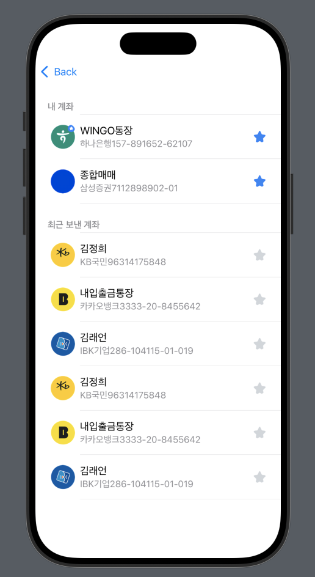
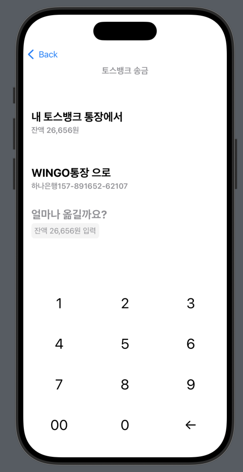
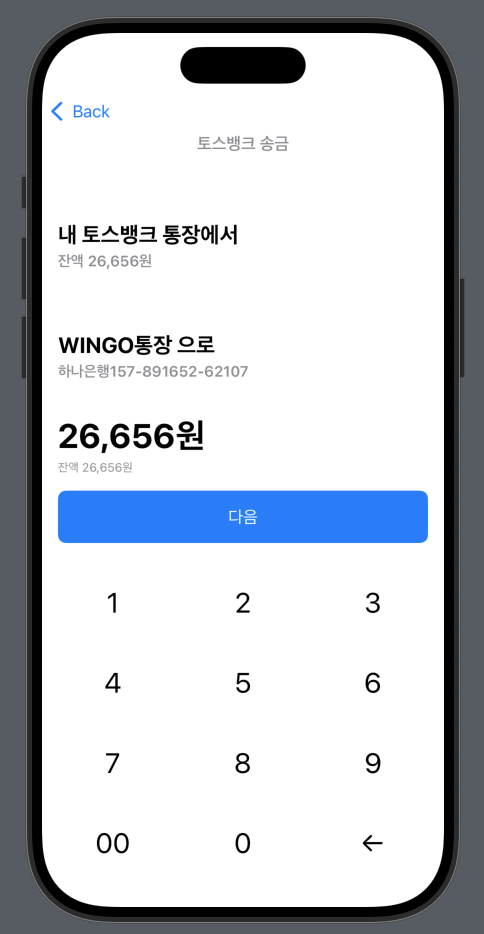
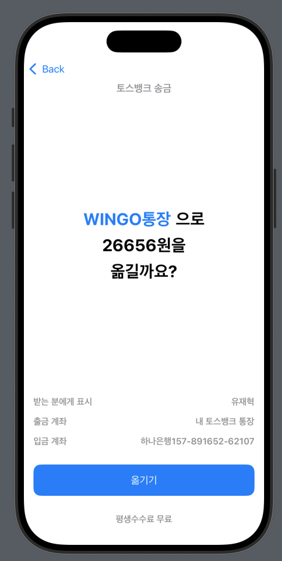
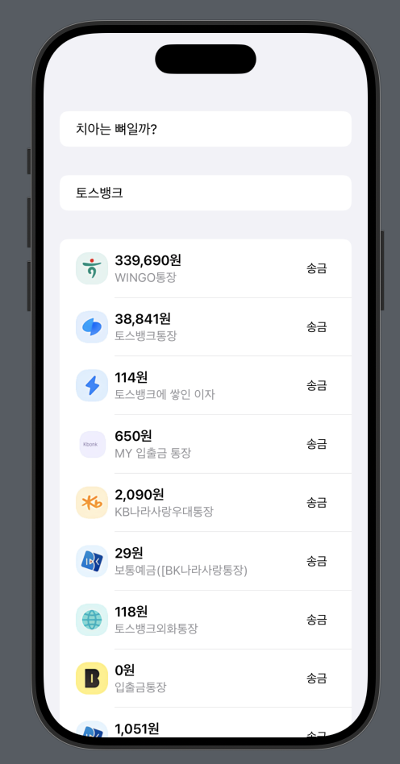

### View1

- 지난 과제 2번 View에서 '보내기'버튼을 누르면 나오는 화면 
- 어떤 계좌로 돈을 송금할지 선택할 수 있음 

### View2

- View1에서 계좌를 선택하면 나오는 화면 
- 선택한 계좌로 돈을 얼마 보낼지 입력할 수 있음 

### View3

- View2에서 '잔액' 버튼을 누르면 나오는 화면 
- 통장의 잔고 내 금액이 입력되었으므로 '다음'버튼이 활성화됨 

### View4

- View2에서 내 통장 잔고보다 큰 금액을 입력했을 때 나오는 화면 
- 통장의 잔고를 초과한 금액이 입력되었으므로 '다음'버튼이 비활성화되며 경고 메세지가 뜸 

### View5 + 홈 이동

  
  

- View3에서 '다음' 버튼을 누르면 나오는 화면 
- 돈을 입금할 계좌 정보와 입금 금액을 확인할 수 있음 
- View5에서 '옮기기' 버튼을 누를 경우, 홈 화면으로 이동됨 

