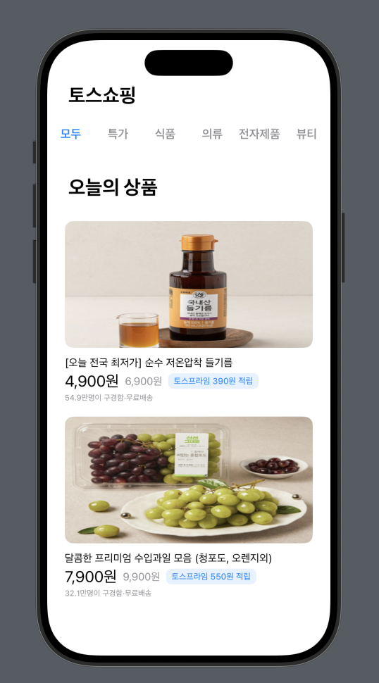
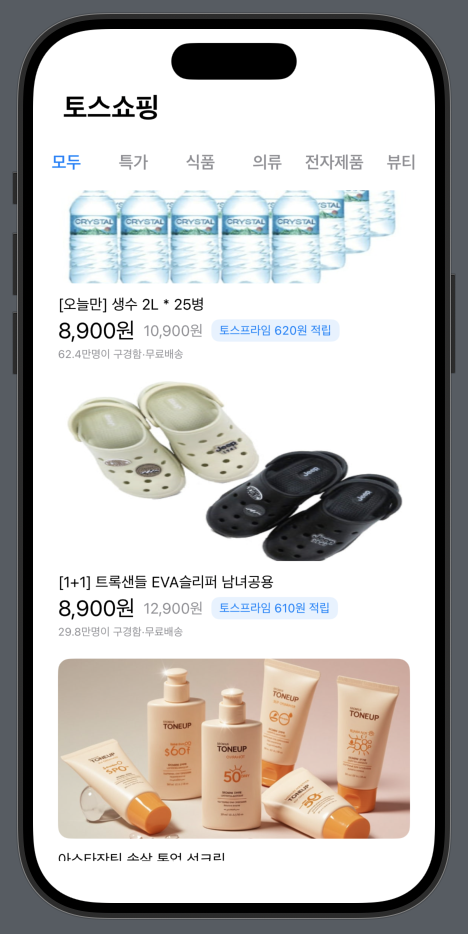
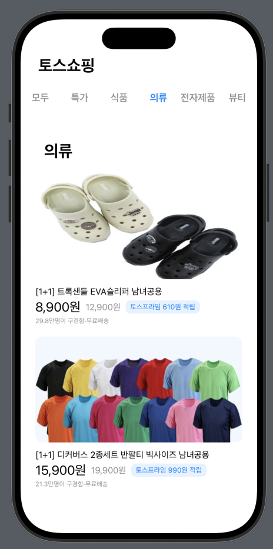
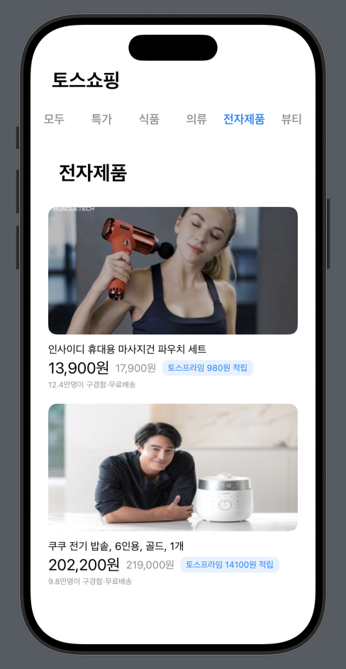
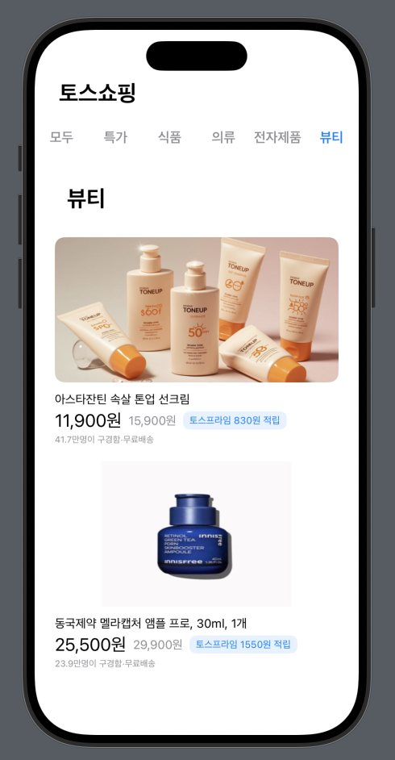

## 🛍️ HW5 - 토스쇼핑 클론코딩

### 구현방식
MVVM 패턴을 이용해 Model, View, ViewModel을 구분하여 구현 

### 실행화면
'모두' 버튼 클릭 -> In_AllTab() 
  
  
 

'특가' 버튼 클릭 -> In_DealsTab() 

 

'식품' 버튼 클릭 -> In_FoodTab() 

 

'의류' 버튼 클릭 -> In_ClothingTab() 

 

'전자제품' 버튼 클릭 -> In_ElectronicTab() 

 

'뷰티' 버튼 클릭 -> In_BeautyTab() 

