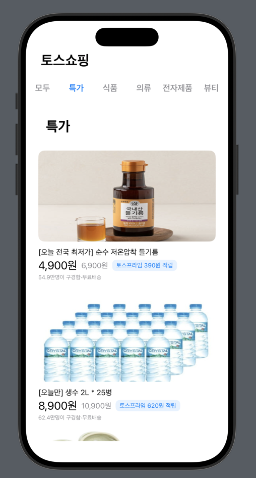

## 🛍️ HW5 - 토스쇼핑 클론코딩

### 구현방식
MVVM 패턴을 이용해 Model, View, ViewModel을 구분하여 구현

### 실행화면
'모두' 버튼 클릭 -> In_AllTab()

  
  

'특가' 버튼 클릭 -> In_DealsTab()

'식품' 버튼 클릭 -> In_FoodTab()

'의류' 버튼 클릭 -> In_ClothingTab()

'전자제품' 버튼 클릭 -> In_ElectronicTab()

'뷰티' 버튼 클릭 -> In_BeautyTab()

